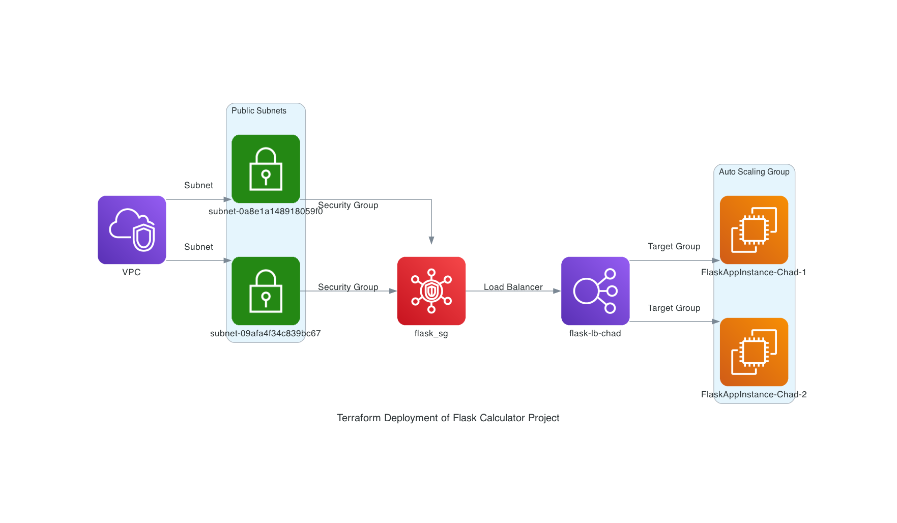

# Terraform Deployment of Flask Calculator Project on AWS EC2 with Load Balancer and Launch Template

This guide details the steps to deploy a Flask calculator application on AWS EC2 instances with an Application Load Balancer using Terraform. The application will run on two EC2 instances and will be accessible through the load balancer.



### Prerequisites

- AWS account with appropriate permissions
- Terraform installed on your local machine
- An existing key pair for SSH access to EC2 instances
- Basic knowledge of AWS and Terraform

### Step-by-Step Guide

#### Step 1: Set Up the Terraform Configuration

1. **Create a new directory for your Terraform files:**

   ```bash
   mkdir terraform-flask-app
   cd terraform-flask-app
   ```

2. **Create a `main.tf` file with the following content:**

   ```hcl
   provider "aws" {
     region  = "us-east-1"
     profile = "devopsbravo"
   }

   resource "aws_security_group" "flask_sg" {
     name        = "flask_sg"
     description = "Allow SSH and HTTP traffic"

     ingress {
       from_port   = 22
       to_port     = 22
       protocol    = "tcp"
       cidr_blocks = ["0.0.0.0/0"]
     }

     ingress {
       from_port   = 80
       to_port     = 80
       protocol    = "tcp"
       cidr_blocks = ["0.0.0.0/0"]
     }

     egress {
       from_port   = 0
       to_port     = 0
       protocol    = "-1"
       cidr_blocks = ["0.0.0.0/0"]
     }
   }

   resource "aws_instance" "flask_instance" {
     count         = 2
     ami           = "ami-0d94353f7bad10668"  # Amazon Linux 2 AMI for us-east-1
     instance_type = "t2.micro"
     key_name      = "cpclass-devopsew-bravo"  # Use the name of your existing key pair
     vpc_security_group_ids = [aws_security_group.flask_sg.id]
     subnet_id     = element(["subnet-0a8e1a148918059f0", "subnet-09afa4f34c839bc67"], count.index)

     tags = {
       Name = "FlaskAppInstance-Chad"
     }

     provisioner "remote-exec" {
       inline = [
         "sudo yum update -y",
         "sudo yum install git -y",
         "sudo yum install python3 -y",
         "sudo pip3 install flask",
         "git clone https://github.com/codeplatoon-devops/calculator-webapp.git",
         "cd calculator-webapp",
         "echo '[Unit]' | sudo tee /etc/systemd/system/flaskapp.service",
         "echo 'Description=Flask App' | sudo tee -a /etc/systemd/system/flaskapp.service",
         "echo 'After=network.target' | sudo tee -a /etc/systemd/system/flaskapp.service",
         "echo '[Service]' | sudo tee -a /etc/systemd/system/flaskapp.service",
         "echo 'User=root' | sudo tee -a /etc/systemd/system/flaskapp.service",
         "echo 'WorkingDirectory=/home/ec2-user/calculator-webapp' | sudo tee -a /etc/systemd/system/flaskapp.service",
         "echo 'ExecStart=/usr/bin/python3 /home/ec2-user/calculator-webapp/calc.py' | sudo tee -a /etc/systemd/system/flaskapp.service",
         "echo 'Restart=always' | sudo tee -a /etc/systemd/system/flaskapp.service",
         "echo 'Environment=\"PATH=/usr/bin:/usr/local/sbin:/usr/local/bin:/usr/sbin:/usr/bin:/sbin:/bin\"' | sudo tee -a /etc/systemd/system/flaskapp.service",
         "echo '[Install]' | sudo tee -a /etc/systemd/system/flaskapp.service",
         "echo 'WantedBy=multi-user.target' | sudo tee -a /etc/systemd/system/flaskapp.service",
         "sudo systemctl daemon-reload",
         "sudo systemctl start flaskapp",
         "sudo systemctl enable flaskapp"
       ]
       connection {
         type        = "ssh"
         user        = "ec2-user"
         private_key = file("/Users/chadthompsonsmith/DevOpsBravo/week-1/keys/cpclass-devopsew-bravo.pem")
         host        = self.public_ip
       }
     }
   }

   resource "aws_lb" "flask_lb" {
     name               = "flask-lb-chad"
     internal           = false
     load_balancer_type = "application"
     security_groups    = [aws_security_group.flask_sg.id]
     subnets            = ["subnet-0a8e1a148918059f0", "subnet-09afa4f34c839bc67"]

     enable_deletion_protection = false
   }

   resource "aws_lb_target_group" "flask_tg" {
     name     = "flask-tg-chad"
     port     = 80
     protocol = "HTTP"
     vpc_id   = "vpc-0f18fbe78893c6397"

     health_check {
       interval            = 30
       path                = "/"
       timeout             = 5
       healthy_threshold   = 2
       unhealthy_threshold = 2
       matcher             = "200"
     }
   }

   resource "aws_lb_listener" "http" {
     load_balancer_arn = aws_lb.flask_lb.arn
     port              = "80"
     protocol          = "HTTP"

     default_action {
       type             = "forward"
       target_group_arn = aws_lb_target_group.flask_tg.arn
     }
   }

   resource "aws_lb_target_group_attachment" "flask_tg_attachment" {
     count            = length(aws_instance.flask_instance[*].id)
     target_group_arn = aws_lb_target_group.flask_tg.arn
     target_id        = element(aws_instance.flask_instance[*].id, count.index)
     port             = 80
   }

   output "elb_dns_name" {
     value = aws_lb.flask_lb.dns_name
   }
   ```

#### Step 2: Initialize and Apply the Terraform Configuration

1. **Initialize Terraform:**

   ```bash
   terraform init
   ```

2. **Apply the Terraform configuration:**

   ```bash
   terraform apply -auto-approve
   ```

   This will create the necessary AWS resources, including EC2 instances, security groups, load balancer, and target groups, and deploy the Flask application.

#### Step 3: Verify the Deployment

1. **Get the DNS name of the load balancer:**

   The output of the `terraform apply` command will provide the DNS name of the load balancer. You can also find it in the AWS Management Console under the EC2 load balancers section.

2. **Access the Flask application:**

   Open a web browser and navigate to the load balancer DNS name. You should see the Flask calculator application running.

#### Step 4: Verify High Availability

1. **Shut down one of the EC2 instances:**

   In the AWS Management Console, navigate to the EC2 instances section and stop one of the EC2 instances running the Flask application.

2. **Verify the application is still accessible:**

   Open a web browser and navigate to the load balancer DNS name. The application should still be accessible, demonstrating high availability.

### Notes

- **Systemd Service Configuration:**

  The `systemd` service file created in the `remote-exec` provisioner ensures the Flask application starts automatically on boot and restarts on failure.

- **Security Group Configuration:**

  The security group allows SSH access on port 22 and HTTP access on port 80 from anywhere.

### Conclusion

This guide has detailed the steps to deploy a Flask calculator application on AWS EC2 instances with an Application Load Balancer using Terraform. The application is configured to run as a systemd service, ensuring high availability and automatic restarts on failure.
